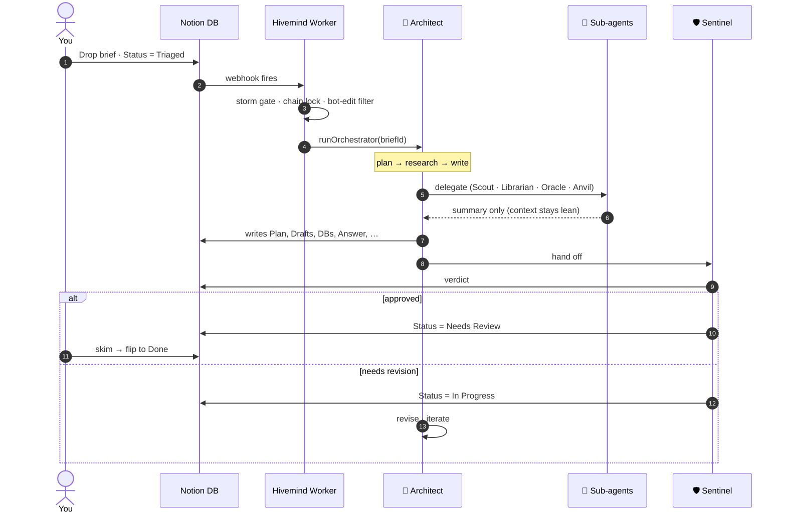

<div align="center">

# 🐝 Hivemind

**A multi-agent operating system that lives inside Notion.**

[](https://luma.com/fyuf7)
[](LICENSE)
[](package.json)
[](tsconfig.json)
[](https://developers.notion.com/docs/notion-workers)
[](https://anthropic.com)
[](#-roadmap)

<p><em>Drop a brief into a Notion database. An autonomous <strong>Architect</strong>, backed by a swarm of specialist sub-agents, plans, researches, builds, and ships the deliverable.<br/>Right inside your workspace. No new tabs. No new tools.</em></p>

</div>

> ### 🏆 Built for the [Notion Developer Platform Hackathon](https://luma.com/fyuf7) · May 16–17, 2026 · San Francisco
>
> Hivemind was built over the weekend Notion launched its [new Developer Platform](https://techcrunch.com/2026/05/13/notion-just-turned-its-workspace-into-a-hub-for-ai-agents/) — Workers, data-source syncs, agent tools, webhooks, _"no servers, no infra, just a CLI and your ideas."_ Sponsored by Anthropic, OpenAI, and Vercel. This repo is the result: a full multi-agent system that uses Notion itself as the database, the orchestrator UI, and the deliverable surface.

---

## ✨ See it in 30 seconds

You write **one row** in a Notion database and flip its `Status` to `Triaged`. Hivemind does the rest.

> **📋 Brief**
>
> **Title:** Build a Notion template for tracking engineering project risks
>
> **Body:** Create a Risk Register database with Name, Severity, Status, Owner, and Captured Date. Seed it with 5 realistic risks for a SaaS launch. Add a Kanban view grouped by Severity so we can see the risk landscape at a glance.

A few minutes later, the same Notion page has grown a whole subtree — **the Architect detected this was a demo-shaped brief** and produced rich Notion artifacts on top of the prose answer:

```text
📁 Build a Notion template for tracking engineering project risks
│
├── 📄 Answer
│   └── "Risk Register template ready. 5 seeded risks, Kanban view by Severity. ↓"
│
├── 📋 Plan
│   ├── Context     "SaaS launch risk tracking. Need severity + status + ownership."
│   ├── Approach    "Create DB + view. Demo mode triggered → rich artifacts."
│   ├── Decisions   [empty — no architectural choices needed]
│   ├── Sources     [empty]
│   └── Status      "Completed."
│
├── 🗃️  Risk Register                    ← created by the Architect at runtime
│   ├── Properties:  Name · Severity · Status · Owner · Captured Date
│   ├── Rows:
│   │   ├── Auth service outage           critical    open        @platform
│   │   ├── Database replication lag      high        open        @infra
│   │   ├── Payment processor delay       high        mitigating  @payments
│   │   ├── Compliance audit failure      medium      open        @security
│   │   └── Team onboarding bottleneck    low         open        @people
│   └── 📊 Kanban view  grouped by Severity (Critical · High · Medium · Low)
│
├── ✏️  Drafts                            (empty — Architect chose writeAnswer)
├── 🔎 Sources                           (empty — no external research needed)
├── ⚖️  Decisions                         (empty)
├── ❓ Open Questions                     (empty)
│
└── 📜 Activity
    └── Architect run #1 — 12,847 tokens · 1m 52s · completed
```

The whole loop runs inside Notion. No new tabs, no separate tool, no dashboard to babysit.

---

## 🧠 How it works



**State machine:** `Backlog → Triaged → In Progress → Needs Review → Done | Failed`

**Belt-and-suspenders:** if the webhook is rate-limited, a `triagedRescue` sync runs every 2 minutes through the same chain lock and picks up whatever the webhook missed. Briefs cannot get stuck at `Triaged`.

---

## 🐝 Meet the swarm

| Agent | Role | When it's called |
|---|---|---|
| **🧠 Architect** | Plans, researches, and writes the deliverable. Sees the whole brief. | **Always.** Drives every run end-to-end. |
| **🔭 Scout** | Workspace search — Notion pages, databases, optional web. | When the brief touches multiple existing workspace pages. |
| **📚 Librarian** | External reference research — official docs, libraries, APIs, articles. | Unfamiliar dependency or non-obvious external behavior. |
| **🔮 Oracle** | Deep analysis with extended thinking. Read-only. | Hard tradeoffs, security implications, complex logic. |
| **🛡️ Sentinel** | Reviews the Architect's output. Approves or requests revision. | **Always**, as a fixed post-step (P3 makes it delegated). |
| **⚒️ Anvil** | Local filesystem · localhost HTTP server · headless Chromium · screenshot proof. | Build-and-demo briefs (landing pages, UI mockups) in `--local` mode. |

Each sub-agent runs in its own context window with its own token budget. Only the `done({summary})` payload returns to the Architect — **sub-agent working tokens never enter the Architect's context**, which is what lets one cheap model orchestrate work that would normally need a frontier model.

---

## 🚀 Quick start

```bash
# 1. Clone + install
git clone https://github.com/kristianvast/hivemind
cd hivemind
npm install
npm install -g @notionhq/workers    # the ntn CLI

# 2. Connect to your Notion workspace (one-time)
ntn login

# 3. Scaffold the Briefs database in Notion
npx tsx scripts/seedBriefs.ts

# 4. Fill in credentials
cp .env.example .env                # then edit .env — see .env.example
                                    # for where to get each token

# 5. Validate before you spend a dollar
npm run check                       # tsc --noEmit
npx tsx scripts/validateBriefsDb.ts # checks schema + env vars

# 6. Run end-to-end against a real brief
ntn workers exec runOrchestrator --local -d '{"briefId":"<page-id>"}'
```

When you're ready to let Notion fire the loop automatically:

```bash
ntn workers deploy                  # publishes the Worker
ntn workers env push                # pushes your .env to the deployed runtime
```

Then add a Notion automation on the Briefs DB: **when `Status is Triaged` → POST to the deployed webhook URL with header `X-Hivemind-Secret: <your secret>`**.

> 💡 **The single most useful debugging command:**
>
> ```bash
> ntn workers runs list --plain | head -n1 | cut -f1 | xargs -I{} ntn workers runs logs {}
> ```

---

## 🚦 Roadmap

| Phase | Description | Status |
|---|---|---|
| **P1** | Single-Architect orchestrator + idempotent subtree provisioning | ✅ shipped |
| **P2** | Sub-agent delegation (Scout · Librarian · Oracle · Anvil) | ✅ shipped |
| **P4** | Unified provisioning shape (was Category-branched in v1) | ✅ shipped |
| **P3** | Sentinel as a delegated sub-agent (currently a fixed post-step) | 🟡 pending |
| **P5** | Multi-turn refinement loop between Sentinel verdicts | 🟡 pending |

The active design doc with decisions D1–D14: [`.sisyphus/plans/hivemind-v2-orchestrator.md`](.sisyphus/plans/hivemind-v2-orchestrator.md). A newer v3 direction ("Notion power-user Architect") is being explored in [`.sisyphus/plans/hivemind-v3-notion-power-user.md`](.sisyphus/plans/hivemind-v3-notion-power-user.md). The original v1 design lives in [`.sisyphus/archive/PLANNING-v1.md`](.sisyphus/archive/PLANNING-v1.md).

---

## ⚒️ Anvil — the local executor

When a brief is **build me something visual** — a landing page, a UI mockup, an interactive prototype — the Architect calls `delegateAnvil` instead of just writing prose. Anvil:

1. Carves a temp directory at `os.tmpdir()/hivemind-anvil-<briefId>-<ts>/`
2. Writes real files (HTML, CSS, JS, assets)
3. Boots a `127.0.0.1` HTTP server on an auto-allocated port
4. Drives a headless Chromium via Playwright
5. Embeds the screenshot **back into the Notion page** as proof
6. Leaves the server running so you can open the URL yourself

```
⚒️   ANVIL SERVERS STILL RUNNING
     • http://127.0.0.1:54231 — Build a Notion template for tracking risks
```

Ctrl+C exits. Anvil only runs in `--local` orchestrator mode — it needs a real filesystem and a real port.

There's also a heavier VM-backed Anvil daemon in [`anvil/`](anvil/) — Pusher-dispatched, runs work inside an E2B Firecracker microVM or a local Lima VM, and ships the result as a GitHub PR. The two paths coexist.

---

## 📐 Architecture

<details>
<summary><strong>Full webhook → orchestrator → agent loop (click to expand)</strong></summary>

```
Notion (Briefs DB)
   │
   │  Status: Backlog → Triaged → In Progress → Needs Review → Done | Failed
   │
   └─▶ onBriefStatusChange  (webhook capability)
          │
          ├─ storm gate       in-memory, per-page, 12 events / 10s
          ├─ chain lock       shared with rescue sync (15 min TTL)
          ├─ bot-edit filter  skip edits the agents themselves make
          ├─ fast-path        non-trigger deliveries cost 1 Notion API call
          │
          └─▶ runOrchestrator(briefId)
                 │
                 ├─ provision subtree   (idempotent)
                 │
                 ├─ Architect  ⟳ tool-use loop
                 │   └─▶ delegateScout / delegateLibrarian / delegateOracle / delegateAnvil
                 │
                 └─ Sentinel post-step ─▶ verdict
                                          ├─ approve → Status = Needs Review
                                          └─ revise  → Status = In Progress (retry)

triagedRescue sync (every 2 min) ─▶ same chain lock ─▶ same runOrchestrator
                                                       (backstop if the webhook is locked out)
```

**Rate-limit defenses, layered so any single misconfiguration cannot strand briefs at `Triaged`:**

| Layer | Lives in | Purpose |
|---|---|---|
| Storm gate | [`src/index.ts`](src/index.ts) | Suppress a page after >12 deliveries in 10s — zero Notion API calls during suppression |
| Chain lock + coalesce | [`src/lock.ts`](src/lock.ts) | One run per brief at a time; absorbs Notion automation retry storms |
| Bot-edit filter | [`src/index.ts`](src/index.ts) | Skip edits made by the agents (matches `HIVEMIND_BOT_USER_ID`) |
| Fast-path early-exit | [`src/index.ts`](src/index.ts) | Non-`Triaged`/`Done` deliveries cost a single `pages.retrieve` call |
| `triagedRescue` sync | [`src/rescue.ts`](src/rescue.ts) | Backstop — runs every 2 min on its own per-capability budget |

**Token budget circuit breaker** — [`src/budget.ts`](src/budget.ts) trips the orchestrator to `Status=Failed` if a single brief burns more than 400k tokens, rather than running up the bill silently.

**State storage** — `HivemindState` lives in a collapsed `🔒 Hivemind internal state (do not edit)` toggle on each brief page (single JSON code block). See [`src/state.ts`](src/state.ts).

</details>

---

## 📂 Project layout

```text
src/
  index.ts          Worker entrypoint · capabilities · webhook router · storm gate
  orchestrator.ts   locks · provisions · runs Architect · runs Sentinel
  architect.ts      Architect system prompt + spec  ← the magic lives here
  subagents.ts      Scout · Librarian · Oracle · Sentinel · Anvil specs
  agents.ts         invokeAgent — uniform wrapper over runAgent
  agentLoop.ts      hand-rolled Anthropic tool-use loop
  anvil.ts          in-process Anvil session (tmp dir · HTTP · Playwright)
  tools/
    registry.ts     tool schemas + per-agent whitelists
    handlers.ts     dispatch + scope guard
  provision.ts      idempotent per-brief subtree provisioner
  notion.ts         block builders · brief context loader · status helpers
  state.ts          HivemindState (collapsed toggle on the brief page)
  scope.ts          write-scope guard (project subtree only)
  rescue.ts         triagedRescue sync — webhook backstop
  lock.ts           chain lock (shared between webhook and rescue)
  budget.ts         per-brief token budget circuit breaker
  pacer.ts          shared Notion API RPS pacer

anvil/              VM-backed executor daemon (separate package)
.examples/          working Notion Workers SDK samples
.agents/            internal-facing agent contract + skills
scripts/            admin scripts (seedBriefs, validateBriefsDb, probe*, …)
```

Internal contract / deep architectural notes: see [`AGENTS.md`](AGENTS.md).

---

## 🛡️ Gotchas worth knowing before you change something

<details>
<summary>Open the gotcha list</summary>

- **`data_source_id`, not `database_id`.** A Notion database is a container for one or more data sources; the public API operates on data sources. The default SDK API version is `2025-09-03`. Use `ntn datasources resolve <db>` to list the data sources inside a DB.
- **Scope guard.** Every agent write goes through [`src/scope.ts`](src/scope.ts). Writes outside the brief's project subtree are caught and reported — not silently dropped. Be deliberate when you add a new tool: wire it through the guard.
- **Bot-edit filter.** Every `Status` write the Architect or Sentinel makes would otherwise loop back through the webhook and trigger another run. The filter compares `page.last_edited_by.id` against `HIVEMIND_BOT_USER_ID`. Keep that env var populated.
- **Tool-use truncation.** If a single Architect response emits more output tokens than its `maxTokens` (default `16384` for the Architect, `8192` for sub-agents), the loop throws `max_tokens hit — agent may have produced truncated tool_use`. Raise the cap if you see this for legitimately large outputs (long `writeAnswer` bodies, big `createChildPage` block arrays).
- **`Status=Triaged` stuck for >5 minutes?** The webhook is probably rate-limited. `ntn workers deploy` resets the per-capability budget, and `triagedRescue` will catch up in the meantime. The full symptom-to-action runbook is in [`AGENTS.md`](AGENTS.md).

</details>

---

## 🤝 Contributing

This started as a hackathon project and is now an open-source research preview. Issues and PRs welcome.

Before submitting code, please read [`AGENTS.md`](AGENTS.md) and the [v2 design doc](.sisyphus/plans/hivemind-v2-orchestrator.md) — the architecture is opinionated and the surface area is small on purpose.

**Style notes**

- TypeScript with `strict` enabled. Explicit types at I/O boundaries.
- **Tabs** for indentation. Capability keys in `lowerCamelCase`.
- Commit format: `feat(scope): …`, `fix(scope): …`, `chore: …`.
- `npm run check` must pass before you push.

---

## 🙏 Thanks

To the Notion team for shipping the Developer Platform and hosting a hackathon that gave this project a starting line. To the sponsors — [Anthropic](https://anthropic.com), [OpenAI](https://openai.com), and [Vercel](https://vercel.com) — for the credits and the encouragement.

---

<div align="center">

**[MIT](LICENSE)** · © 2026 Kristian Vast

</div>
